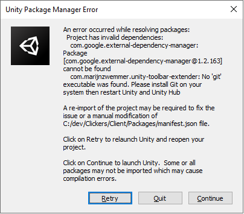
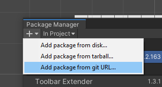

####  Ресурсы проекта
- [Репозиторий клиента на Github](https://github.com/semi92art/Clickers)
- [Репозиторий RestAPI на Github](https://github.com/semi92art/ClickersAPI)
- Репозиторий RestAPI на DockerHub: `drago1/clickersapi`
- [Логи RestAPI на сервере](http://77.37.152.15:9000/#/home), Логин: `vip_admin`, Пароль: `anthony1980`
- [Zeplin](https://zpl.io/aXB9Rzx)
- Музыка и звуковые эффекты:
	1. [freemusicarchive](https://freemusicarchive.org/home)
	2. [getbeat](https://getbeat.ru/)
	3. [dl-sounds](https://www.dl-sounds.com/royalty-free/category/game-film/video-game/)
	4. [videvo](https://www.videvo.net/)
	5. [storyblocks](https://www.storyblocks.com/audio)
	6. [8 bit generator](https://sfxr.me/)

---

#### Настройка рабочего окружения

1. Скачать и установить [Unity 2019.4.16f1](https://download.unity3d.com/download_unity/e05b6e02d63e/Windows64EditorInstaller/UnitySetup64.exe?_ga=2.211196373.1330797353.1633497524-1378656195.1586531758),
2. Скачать и установить [поддержку Android](https://download.unity3d.com/download_unity/e05b6e02d63e/TargetSupportInstaller/UnitySetup-Android-Support-for-Editor-2019.4.16f1.exe?_ga=2.186602985.1330797353.1633497524-1378656195.1586531758)
3. Скачать и установить [поддержку iOS](https://download.unity3d.com/download_unity/e05b6e02d63e/TargetSupportInstaller/UnitySetup-iOS-Support-for-Editor-2019.4.16f1.exe?_ga=2.186602985.1330797353.1633497524-1378656195.1586531758)

---

#### Устранение неполадок при первом запуске

Если при загрузке Unity появляется окно, изображенное на рис. 1: 

	

Рисунок 1

то в этом случае нужно выполнить следующие действия:

1. Скопировать содержимое папки [cache](Client/_Other/cache) в папку C:\Users\[Имя пользователя]\AppData\Local\Unity\cache
2. С помощью Unity Package Manager (рис. 2) Добавить ссылку на git репозиторий:
<code>https://github.com/marijnz/unity-toolbar-extender.git</code>

	

Рисунок 2

Если при запуске Unity появляются ошибки, связанные с Layout-ом, которые невозможно исправить простыми способами, требуется заменить содержимое файла <code>Client/Library/CurrentLayout-default.dwlt</code>  на содержимое файла <code>Client/_Other/Default.dwlt</code>

---

#### Другие ресурсы

[README Web Api-шки](Server/README.md)

